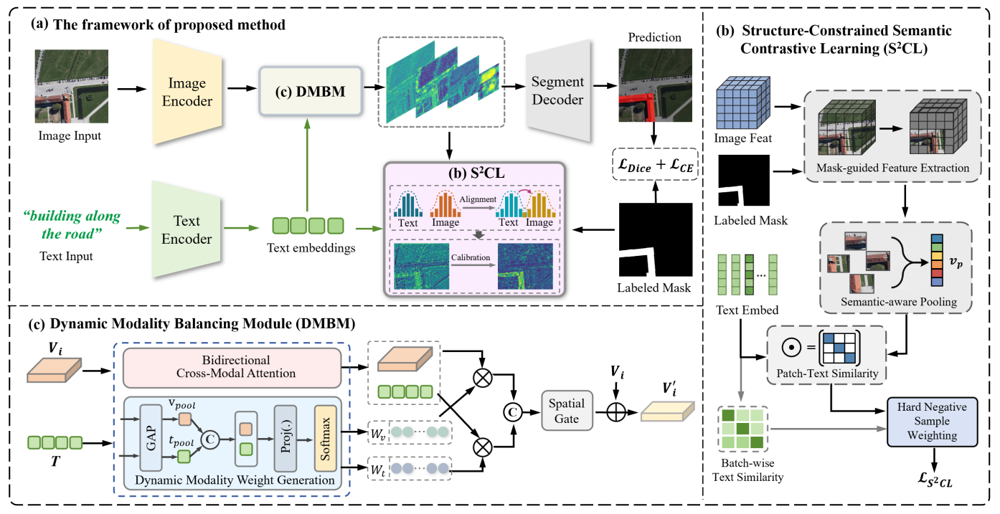

# S2CLNet

Official implementation of **S2CLNet: Structure-Constrained Semantic Contrastive Learning for Referring Remote Sensing Image Segmentation**.



This repository contains two implementations used in the paper:

```text
clip/   CLIP visual-language implementation
swin/   Swin Transformer + BERT implementation
```

The repository contains model code and dataset adapters only. Dataset files, experiment outputs, and large pretrained weights are excluded from Git.

## Environment

The code was developed with Python 3.7, PyTorch 1.7.1, and CUDA 10.2.

```bash
conda create -n s2clnet python=3.7
conda activate s2clnet
conda install pytorch=1.7.1 torchvision=0.8.2 torchaudio=0.7.2 cudatoolkit=10.2 -c pytorch
pip install -r requirements.txt
```

## Data and Weights

Place the original datasets in `refer/data/`. Empty directory placeholders for RRSIS-D and RefSegRS are included.

Download the required weights separately:

- CLIP RN101: `clip/pretrained_weights/RN101.pt`
- Swin-B: `swin/pretrained_weights/swin_base_patch4_window12_384_22k.pth`
- BERT checkpoint: place local files under `swin/bert-base-uncased/`

The actual datasets and weight files are not proposed or distributed by this work.

## CLIP Implementation

```bash
cd clip
python train.py --dataset refsegrs --refer_data_root ../refer/data/RefSegRS --pretrained_clip_weights ./pretrained_weights/RN101.pt
python test.py --dataset refsegrs --refer_data_root ../refer/data/RefSegRS --pretrained_clip_weights ./pretrained_weights/RN101.pt --resume ./checkpoints/S2CLNet/model_best_S2CLNet.pth
```

The CLIP model, tokenizer, data adapters, loss, and training utilities are contained in `clip/`.

## Swin-BERT Implementation

```bash
cd swin
python train.py --dataset refsegrs --refer_data_root ../refer/data/RefSegRS --ck_bert ./bert-base-uncased --bert_tokenizer ./bert-base-uncased --pretrained_swin_weights ./pretrained_weights/swin_base_patch4_window12_384_22k.pth
python test.py --dataset refsegrs --refer_data_root ../refer/data/RefSegRS --ck_bert ./bert-base-uncased --bert_tokenizer ./bert-base-uncased --pretrained_swin_weights ./pretrained_weights/swin_base_patch4_window12_384_22k.pth --resume ./checkpoints/S2CLNet-SwinBERT/model_best_S2CLNet-SwinBERT.pth
```

The Swin visual backbone, BERT source implementation, BERT tokenizer metadata, model components, and data adapters are contained in `swin/`.

## Citation

Please cite the S2CLNet paper when using this code. The implementation builds on the open-source LAVT, Swin Transformer, BERT, and OpenAI CLIP projects.
